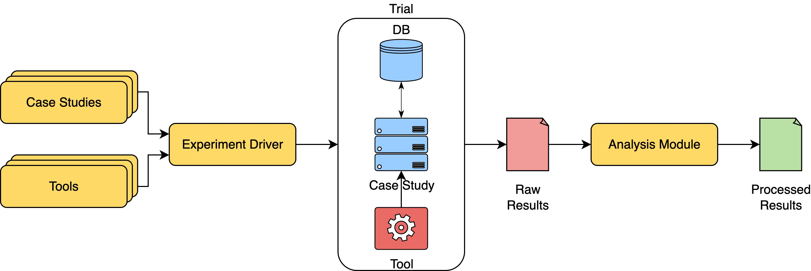

# BenGQL: An Extensible Benchmarking Framework for Automated GraphQL Testing
*BenGQL* is a benchmarking framework designed to facilitate the testing and evaluation of GraphQL APIs.
It provides a collection of *case studies*, *tools*, and *analysis modules* to help researchers and developers assess the performance and security of GraphQL implementations.
Contributions to this repository are welcome, and we encourage users to add new case studies, tools, and analysis scripts to enhance the framework's capabilities.



## Repository structure
- `case_studies`: Contains the case studies (Consisting of a Dockerfile and a docker-compose.yml file). See [./docs/CASE_STUDIES.md](./docs/CASE_STUDIES.md) to add new case studies.
- `tools`: Contains the tools used to test the case studies. See [./docs/TOOLS.md](./docs/TOOLS.md) to add new tools.
- `analysis`: Contains the scripts to analyse the results. See [./docs/ANALYSIS.md](./docs/ANALYSIS.md) to add new analysis scripts.
- `results`: This is the default location for the results of the tests. `analysis` scripts should look for the results here.
- `utils`: Contains miscellaneous scripts.

## Case studies

| Project | Framework | Integration status |
| ------- | --------- | ------------------ |
| [CatalysisHubBackend](https://github.com/SUNCAT-Center/CatalysisHubBackend) | Flask-GraphQL | ❌ |
| [countries](https://github.com/trevorblades/countries) | Yoga | ✅ |
| [ehri-rest](https://github.com/EHRI/ehri-rest) | GraphQL Java | ❌ |
| [fruits-api](https://github.com/Franqsanz/fruits-api) | Apollo | ❌ |
| [Gitlab-CE](https://docs.gitlab.com/install/docker/) | GraphQL Ruby | ✅ |
| [sierra](https://github.com/hivdb/sierra) | GraphQL Java | ❌ |
| [rick-and-morty-api](https://github.com/afuh/rick-and-morty-api) | apollo-server-express | ✅ |
| [react-ecommerce](https://github.com/react-shop/react-ecommerce) | Nestjs-GraphQL | ✅ |
| [graphql-ncs](https://github.com/WebFuzzing/EMB/) | graphql-java-tools | ✅ |
| [graphql-scs](https://github.com/WebFuzzing/EMB/) | graphql-java-tools | ✅ |
| [spring-petclinic-graphql](https://github.com/spring-petclinic/spring-petclinic-graphql) | Spring for GraphQL | ✅ |
| [ReactFinland](https://github.com/ReactFinland/graphql-api) | express‑graphql | ✅ |
| [timbuctoo](https://github.com/HuygensING/timbuctoo) | GraphQL-Java | ✅ |
| [Gatsby](https://github.com/gatsbyjs/gatsby) | graphql-js | ✅ |
| [payload](https://github.com/payloadcms/payload) | graphql-js | ❌ |
| [twenty](https://github.com/twentyhq/twenty/) | nestjs/apollo | ✅ |
| [directus](https://github.com/directus/directus) | graphql-ws | ✅ |
| [hey](https://github.com/heyverse/hey) | graphql-codegen | ✅ |
| [rxdb](https://github.com/pubkey/rxdb) | express-graphql | ✅ |
| [saleor](https://github.com/saleor/saleor) | Graphene | ❌ |
| [parse-server](https://github.com/parse-community/parse-server) | Apollo | ✅ |
| [redwoodjs-graphql](https://github.com/redwoodjs/graphql) | Yoga | ✅ |
| [amplication](https://github.com/amplication/amplication) | nestjs/apollo | ✅ |
| [dvga](https://github.com/dolevf/Damn-Vulnerable-GraphQL-Application) | Apollo | ✅ |

## Tools
| Tool | Description | Integration status |
| ---- | ----------- | ------------------ |
| [EvoMaster](https://github.com/WebFuzzing/EvoMaster) | A web fuzzing tool for automated test generation and execution | ✅ (Black-box mode only) |
| [Apollo Rover CLI](https://github.com/apollographql/rover) | A command-line tool for schema introspection | ✅ |
| [graphw00f](https://github.com/dolevf/graphw00f) | Server Engine fingerprinting | ❌ (Coming soon) |
| [graphql-cop](https://github.com/dolevf/graphql-cop) | A tool for GraphQL security analysis | ✅ |
| [GraphQLer](https://github.com/omar2535/GraphQLer) | A cutting edge context aware GraphQL API fuzzing tool | ⚠️ (No support for time budget yet) |


## Requirements
- Docker
- Docker Compose

## Usage
On *BenGQL*, you can run *experiments*, which are a set of pairs of *case study* and *tool*, forming a *trial*.
You can run experiments using the `run_experiments.sh` script, which is located in the root directory of the repository.
This script allows you to run experiments in parallel, with a time budget for each trial.
You can also specify the tools and case studies to run, or run all of them.

Arguments for the `run_experiments.sh` script:
- `--exp_name EXP_NAME`: The name of the experiment. This will be used to name the output directory.
- `--tools TOOL1,TOOL2,... | all`: The tools to run in the experiment. You can specify a comma-separated list of tools, or use `all` to run all tools.
- `--case_studies CS1,CS2,... | all`: The case studies to run in the experiment. You can specify a comma-separated list of case studies, or use `all` to run all case studies.
- `--max_parallel_tests N`: The maximum number of parallel trials to run. This is useful to limit the number of concurrent Docker containers.
- `--time_budget TIME_IN_SECONDS`: The time budget for each trial. If a trial exceeds this time, it will be stopped.

### Example usage
The command below runs an experiment named `my_experiment` with the `EvoMaster` tool on the `countries` and `react-ecommerce` case studies, and a time budget of 3600 seconds (1 hour): 
```bash
./run_experiments.sh --exp_name my_experiment --tools EvoMaster --case_studies countries,react-ecommerce --time_budget 3600
```

## Known Issues
- The `countries` case study on MacOS (ARM) sometimes fails to compile (qemu: uncaught target signal 11 (Segmentation fault) - core dumped). If this happens, just try to compile the container again and will work like a charm.
- Docker networks can be filled with unused containers, which can cause issues with the `docker-compose up` command. If you encounter issues, try running `docker network prune` to clean up unused networks.